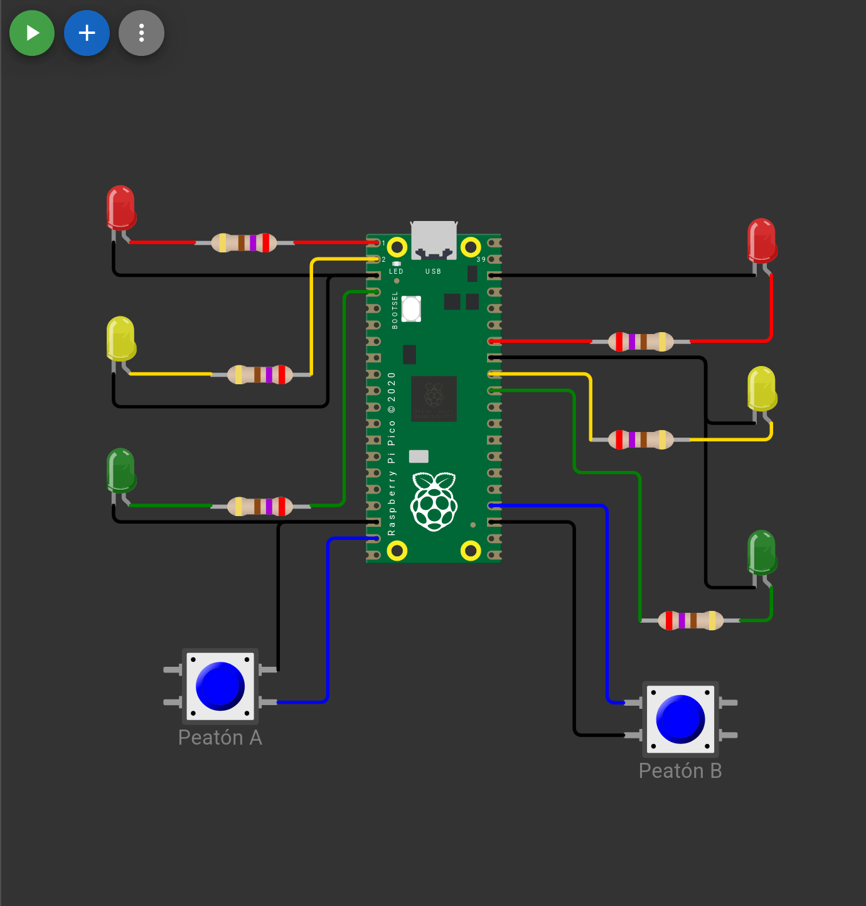
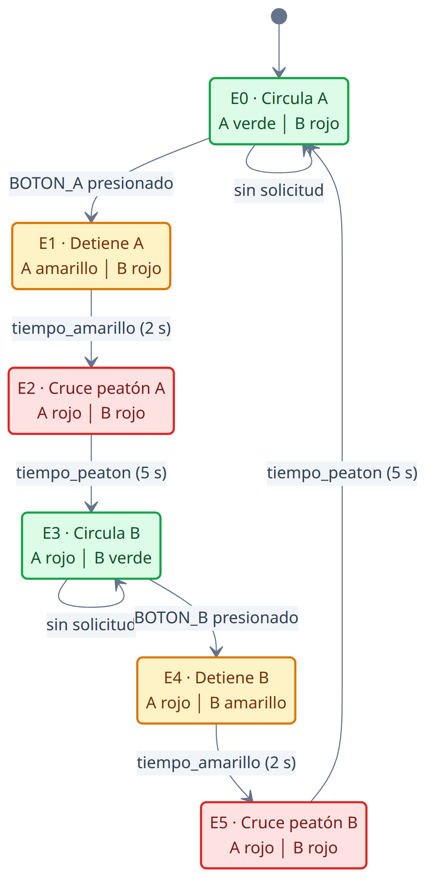
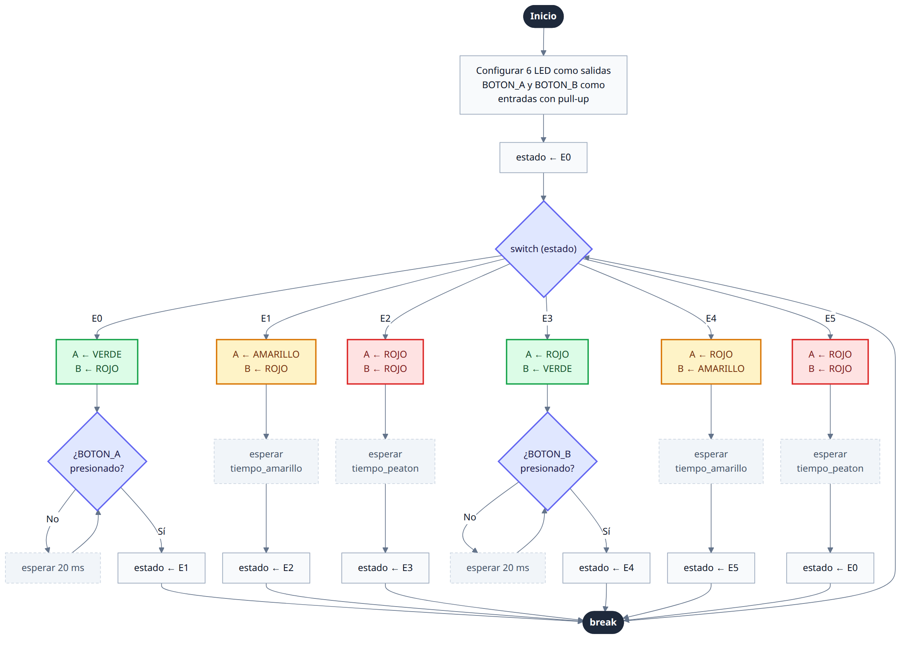
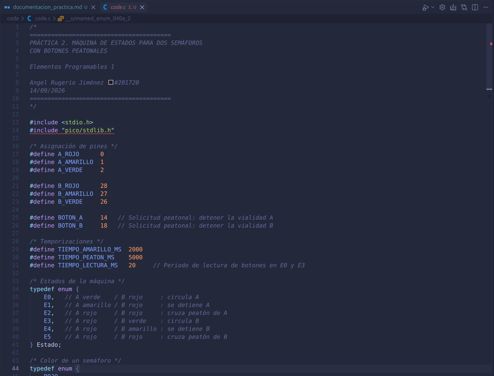
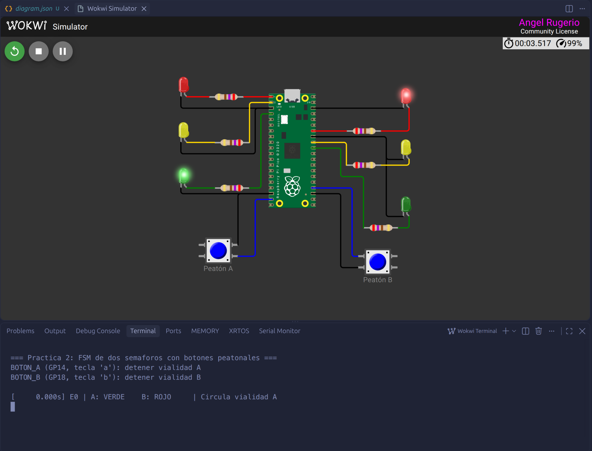
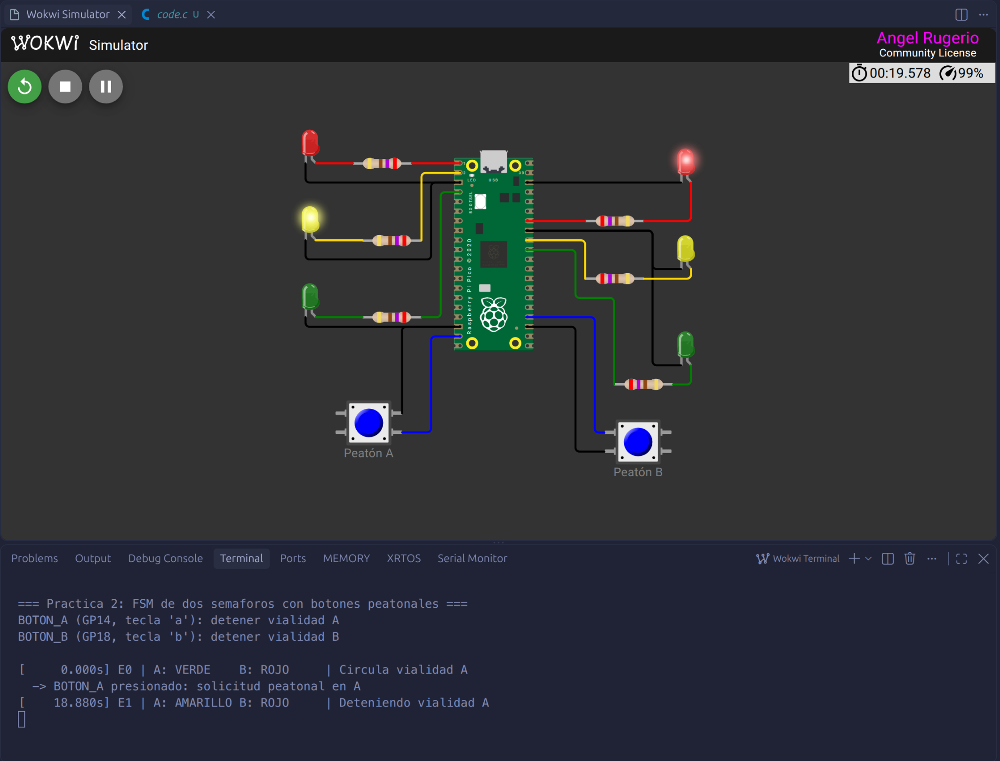
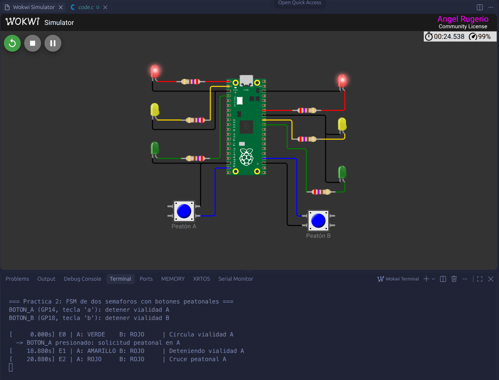
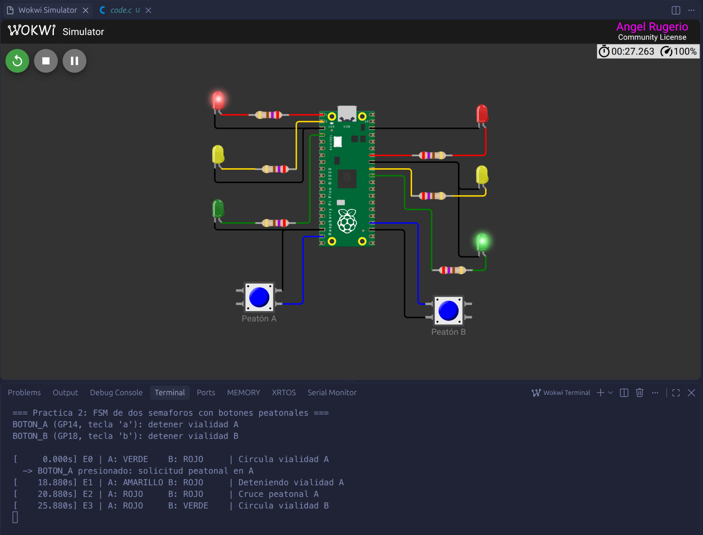
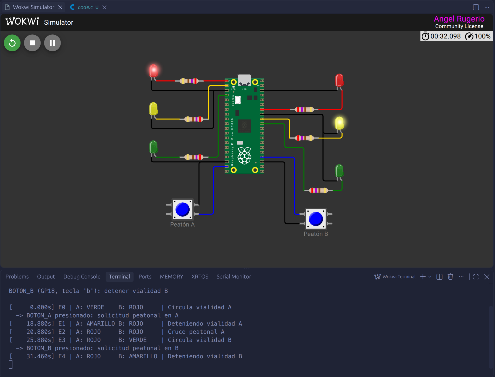
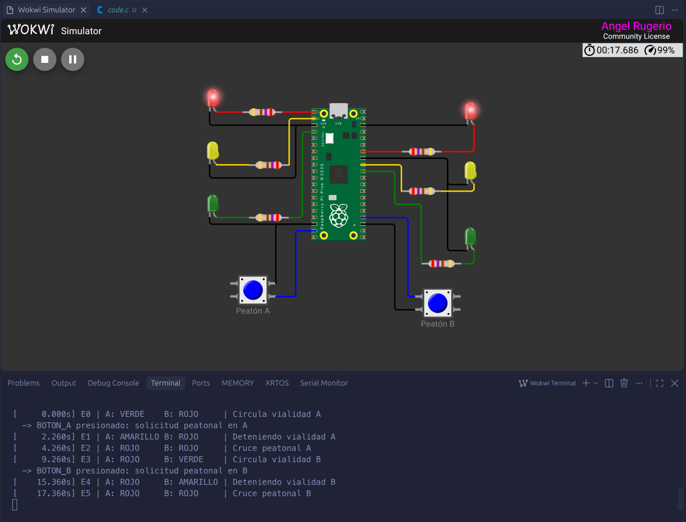

# Práctica 2: Máquina de estados para dos semáforos con botones peatonales

## 1. Diagrama de conexión realizado en Wokwi.

Archivo disponible aquí: [Diagrama_Wokwi](code/diagram.json)


### Asignación de GPIO

| Elemento        | GPIO | Configuración                        |
|-----------------|------|--------------------------------------|
| Rojo A          | GP0  | Salida (resistencia de 270 Ω)        |
| Amarillo A      | GP1  | Salida (resistencia de 270 Ω)        |
| Verde A         | GP2  | Salida (resistencia de 270 Ω)        |
| Rojo B          | GP28 | Salida (resistencia de 270 Ω)        |
| Amarillo B      | GP27 | Salida (resistencia de 270 Ω)        |
| Verde B         | GP26 | Salida (resistencia de 270 Ω)        |
| BOTON_A         | GP14 | Entrada con pull-up interno (a GND)  |
| BOTON_B         | GP18 | Entrada con pull-up interno (a GND)  |
| Serial TX / RX  | GP16 / GP17 | UART0, 115200 baudios (monitor serial) |

Los botones se conectan entre el GPIO y GND. Con la resistencia pull-up interna, el pin lee `1` en reposo y `0` al presionar.

El UART se movió a GP16/GP17 porque GP0 y GP1 (los pines por defecto del Serial) se usan para las luces roja y amarilla del semáforo A.

## 2. Algoritmo en lenguaje natural

1. Iniciar el programa y la comunicación serial.
2. Configurar los seis pines de los LED como salidas digitales y apagarlos.
3. Configurar BOTON_A y BOTON_B como entradas digitales con resistencia pull-up.
4. Colocar el sistema en el estado E0.
5. Repetir indefinidamente, según el estado actual:
   - **E0:** Encender verde en A y rojo en B. Revisar el BOTON_A cada 20 ms. Mientras no se presione, permanecer en E0. Al presionarlo, pasar a E1.
   - **E1:** Encender amarillo en A. B sigue en rojo. Esperar el tiempo de amarillo (2 s) y pasar a E2.
   - **E2:** Encender rojo en ambos semáforos. El peatón de la vialidad A cruza. Esperar el tiempo de cruce (5 s) y pasar a E3.
   - **E3:** Mantener rojo en A y encender verde en B. Revisar el BOTON_B cada 20 ms. Mientras no se presione, permanecer en E3. Al presionarlo, pasar a E4.
   - **E4:** A sigue en rojo. Encender amarillo en B. Esperar el tiempo de amarillo (2 s) y pasar a E5.
   - **E5:** Encender rojo en ambos semáforos. El peatón de la vialidad B cruza. Esperar el tiempo de cruce (5 s) y regresar a E0.
6. Cada vez que se entra a un estado, enviar por el puerto serial el estado actual y el color que muestra cada semáforo.

## 3. Diagrama de estados

Colores: verde = una vialidad circula, ámbar = transición en amarillo, rojo = cruce peatonal con ambos semáforos en rojo.




## 4. Diagrama de flujo




## 5. Código fuente en C

El código esta disponible en: [Código en C](code/code.c)


## 6. Captura de funcionamiento

### E0:

### E1:

### E2:

### E3:

### E4:

### E5:


## 7. Enlace a Wokwi
**https://wokwi.com/projects/475191928359188481**

## 8. Explicación de los seis estados y sus transiciones

La máquina tiene dos estados **estables** (E0 y E3). Solo salen de ellos cuando un peatón presiona su botón. Los otros cuatro estados son **temporizados** y avanzan solos cuando termina su `sleep_ms()`. El botón no enciende ni apaga LED. Solo genera una solicitud, y el `switch-case` decide cuándo cambian los semáforos.

- **E0 (A verde / B rojo):** circula la vialidad A. Es el estado inicial. Transición: BOTON_A presionado → E1.
- **E1 (A amarillo / B rojo):** avisa a los conductores de A que el paso se va a cerrar. Así se cumple que A no pasa de verde a rojo sin amarillo. Transición: termina `TIEMPO_AMARILLO_MS` (2 s) → E2.
- **E2 (A rojo / B rojo):** periodo de seguridad. El peatón de la vialidad A cruza. Transición: termina `TIEMPO_PEATON_MS` (5 s) → E3.
- **E3 (A rojo / B verde):** circula la vialidad B. Transición: BOTON_B presionado → E4.
- **E4 (A rojo / B amarillo):** avisa a los conductores de B que el paso se va a cerrar. Transición: termina `TIEMPO_AMARILLO_MS` (2 s) → E5.
- **E5 (A rojo / B rojo):** periodo de seguridad. El peatón de la vialidad B cruza. Transición: termina `TIEMPO_PEATON_MS` (5 s) → E0.

### Condiciones de seguridad:
- En ningún estado están los dos semáforos en verde. La función `poner_semaforo()` enciende solo un color por semáforo, y solo E0 y E3 tienen un verde.
- Todo verde pasa a amarillo antes de rojo (E0→E1 y E3→E4).
- En E2 y E5 ambos semáforos están en rojo.

### Retroalimentación serial: 
- Al entrar a cada estado, el programa lee de vuelta los GPIO de los LED e imprime lo que realmente muestra cada semáforo. Si detectara ambos verdes, imprimiría un error. Ejemplo de salida:

```
[     0.000s] E0 | A: VERDE    B: ROJO     | Circula vialidad A
  -> BOTON_A presionado: solicitud peatonal en A
[     3.420s] E1 | A: AMARILLO B: ROJO     | Deteniendo vialidad A
[     5.420s] E2 | A: ROJO     B: ROJO     | Cruce peatonal A
[    10.421s] E3 | A: ROJO     B: VERDE    | Circula vialidad B
```

> [!Note]
> Nota sobre retroalimentación serial: como tal no fue algo que nos pidio, pero, en Laboratorio de Elementos Programables vimos cómo hacer esto y consideré que era un buen aditamento para ver cómo es que avanza el programa y cambian los estados.
