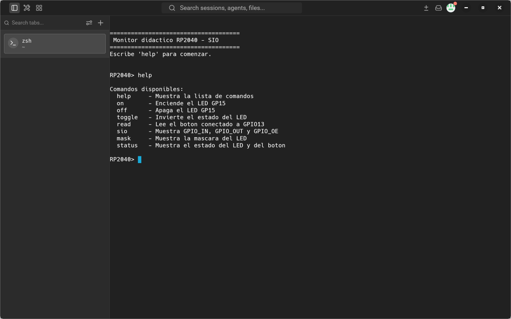
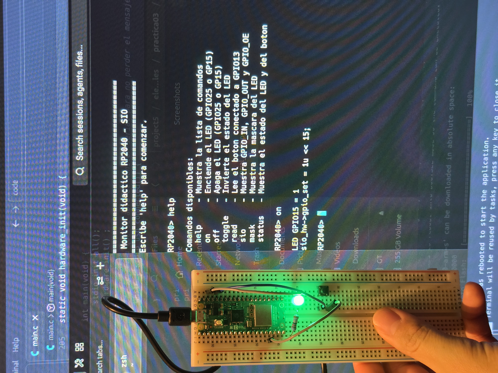
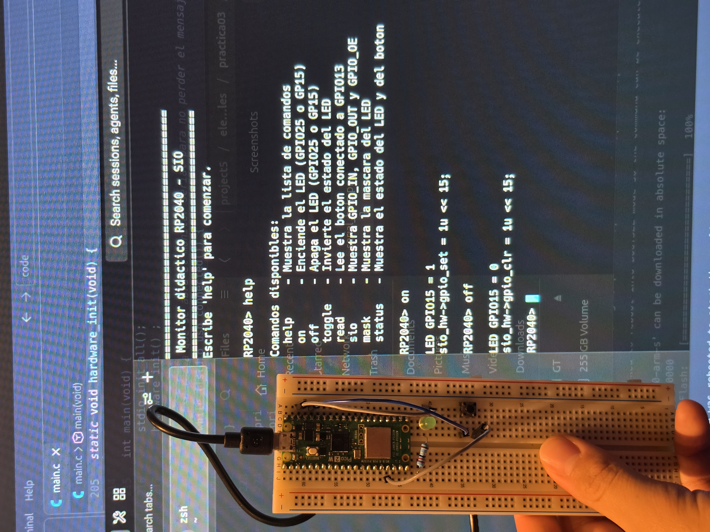
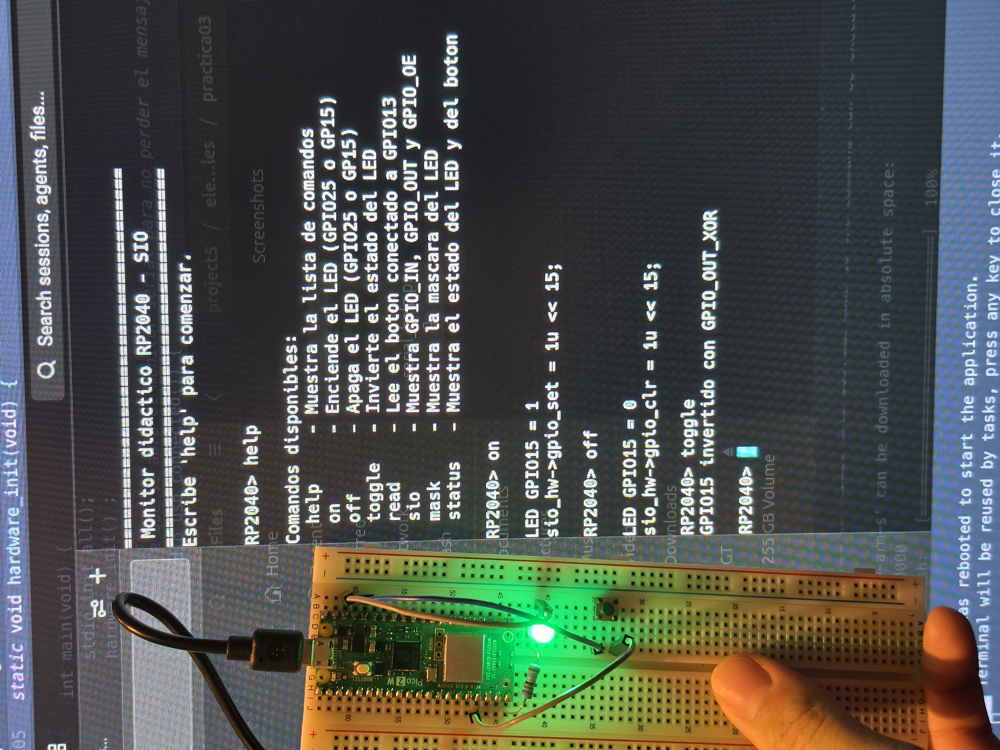
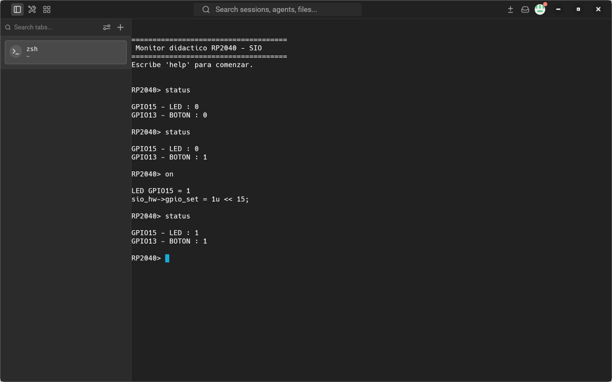

# Práctica 3: Monitor interactivo del RP2040 y exploración del SIO

Angel Rugerio Jiménez #201720 — Elementos Programables I

Código en [`code/`](code/) · capturas y fotos en [`evidence/`](evidence/)

## Hardware

| Elemento | GPIO   | Configuración                                   |
|----------|--------|-------------------------------------------------|
| LED      | GP15   | Salida, LED externo con 330 Ω a GND             |
| Botón    | GPIO13 | Entrada con pull-down interno, botón a 3.3 V OUT |
| Consola  | USB    | USB CDC (`pico_enable_stdio_usb`)               |

Con el pull-down interno, GPIO13 lee `0` con el botón libre y `1` al presionarlo.

### Adaptación a Raspberry Pi Pico 2 W

La práctica está escrita para la Pico original (RP2040). La placa usada es una **Pico 2 W** (RP2350), y eso cambia tres cosas:

- **LED:** en la Pico 2 W el LED integrado está conectado al chip inalámbrico (CYW43), no a un GPIO, así que el SIO no puede controlarlo. Por eso el código define `LED_PIN 15` y usa un LED externo en **GP15**. En esta placa el bit que cambia es el **15** (`1u << 15` = `0x00008000`) y no el 25.
- **Offsets del SIO:** el RP2350 tiene 48 GPIO y sus registros `_HI` quedan intercalados, así que varios offsets son distintos (ver Parte 7). `SIO_BASE` sigue siendo `0xD0000000` y el código no cambia, porque `sio_hw_t` ya trae los offsets correctos de cada chip.
- **Espera del USB:** `main()` espera con `stdio_usb_connected()` a que se abra el monitor serial antes de imprimir el encabezado; si no, el mensaje se imprime antes de que la PC abra el puerto y se pierde.

### Botón atrapado en 1 (errata RP2350-E9)

En algunas pruebas GPIO13 se quedó leyendo `1` después de soltar el botón. Es una errata conocida del RP2350 (E9): con el pull-down interno, el pin puede quedarse retenido en alto. Se mantuvo el pull-down interno para respetar el circuito que pide la práctica. La solución, si hiciera falta, es una resistencia pull-down externa (~10 kΩ) entre GPIO13 y GND.

## Cómo ejecutarlo

1. Compilar y cargar con **Run Project (USB)** de la extensión Raspberry Pi Pico en VS Code.
2. Abrir el puerto `/dev/ttyACM0` en un monitor serial. En el Serial Monitor de VS Code, cambiar **Line ending** a `CRLF` (por defecto es `None` y los comandos no se ejecutan) o activar **Terminal Mode**. Desde terminal: `screen /dev/ttyACM0 115200`.
3. Al abrir el puerto aparece el encabezado y el prompt `RP2040>`.

## Evidencia 1. Monitor funcionando y comando `help`



## Evidencia 6. Tabla de observaciones de comandos

| Comando  | ¿Qué ocurrió físicamente? | ¿Qué mostró la terminal? |
|----------|---------------------------|--------------------------|
| `on`     | El LED de GP15 enciende. | `LED GPIO15 = 1` y `sio_hw->gpio_set = 1u << 15;` |
| `off`    | El LED se apaga. | `LED GPIO15 = 0` y `sio_hw->gpio_clr = 1u << 15;` |
| `toggle` | El LED cambia de estado (apagado → encendido en la foto). | `GPIO15 invertido con GPIO_OUT_XOR` |
| `read`   | Nada; solo lee. | `GPIO_IN = 0x00000000` y `GPIO13 = 0` con el botón libre |
| `sio`    | Nada; solo lee. | `SIO_BASE = 0xD0000000` y GPIO_IN, GPIO_OUT, GPIO_OE en hexadecimal y binario |
| `mask`   | Nada; solo imprime. | `1u << 15`, `Hex: 0x00008000` y su valor en binario |

<p>
  
  
  
</p>

De izquierda a derecha: `on`, `off` y `toggle`.


## Evidencia 2. GPIO_OUT con el LED apagado y encendido


| Estado del LED | Esperado (Pico 2 W, GP15) | Observado |
|----------------|---------------------------|-----------|
| Apagado        | `0x00000000`              | `0x00000000` |
| Encendido      | `0x00008000`              | `0x00008000` |

Cambia únicamente el **bit 15**. Relación pedida en la parte 3:

GP15 → bit 15 de GPIO_OUT → `1u << 15` → `0x00008000` → `0000 0000 0000 0000 1000 0000 0000 0000`

En la Pico original, con el LED integrado, sería GPIO25 → `1u << 25` → `0x02000000`.

Con el LED encendido, **GPIO_IN también muestra el bit 15** (`0x00008000`): GPIO_IN lee el nivel real de todos los pines, incluidas las salidas.

## Evidencia 3. GPIO13 con el botón libre y presionado


| Botón      | GPIO13 esperado | Bit 13 en GPIO_IN esperado    | Observado (`read`) |
|------------|-----------------|-------------------------------|--------------------|
| Libre      | 0               | 0                             | `GPIO_IN = 0x00000000`, `GPIO13 = 0` |
| Presionado | 1               | 1 (`1u << 13` = `0x00002000`) | `GPIO_IN = 0x00002000`, `GPIO13 = 1` |

GPIO_IN puede traer otros bits en 1 que no son del botón (por ejemplo el bit 15 cuando el LED está encendido). Por eso se aplica la máscara y no se compara el registro completo.

## Parte 5. Interpretación de GPIO_OE

GPIO_OE observado: `0x00008000` (`0000 0000 0000 0000 1000 0000 0000 0000`), igual en todas las capturas.

- **Bit 15 = 1** → GP15 (LED) está habilitado como salida (`hardware_init()` hace `gpio_oe_set = LED_MASK`).
- **Bit 13 = 0** → salida deshabilitada en GPIO13, se usa como entrada (`gpio_oe_clr = BUTTON_MASK`).

| Registro   | Función                                             |
|------------|-----------------------------------------------------|
| `GPIO_IN`  | Estado lógico observado en los GPIO                 |
| `GPIO_OUT` | Valor almacenado para las salidas                   |
| `GPIO_OE`  | Determina cuáles GPIO están habilitados como salida |

## Parte 6. Revisión guiada del código

| Línea | Operación de hardware |
|-------|------------------------|
| `#define LED_PIN 15` / `#define BUTTON_PIN 13` | Número de GPIO = número de bit dentro de los registros del SIO. |
| `#define LED_MASK (1u << LED_PIN)` | Palabra de 32 bits con solo el bit 15 en 1 (`0x00008000`). |
| `#define BUTTON_MASK (1u << BUTTON_PIN)` | Palabra de 32 bits con solo el bit 13 en 1 (`0x00002000`). |
| `sio_hw->gpio_set = LED_MASK;` | Escribe en GPIO_OUT_SET: pone en 1 el bit 15 de GPIO_OUT, el LED enciende. |
| `sio_hw->gpio_clr = LED_MASK;` | Escribe en GPIO_OUT_CLR: pone en 0 el bit 15 de GPIO_OUT, el LED apaga. |
| `sio_hw->gpio_togl = LED_MASK;` | Escribe en GPIO_OUT_XOR: invierte el bit 15 de GPIO_OUT. |
| `uint32_t entradas = sio_hw->gpio_in;` | Lee GPIO_IN completo, todos los pines a la vez. |
| `bool boton = (entradas & BUTTON_MASK) != 0;` | Se queda solo con el bit 13; si no es 0, el botón está presionado. |
| `sio_hw->gpio_oe_set = LED_MASK;` | Escribe en GPIO_OE_SET: bit 15 de GPIO_OE en 1, GP15 es salida. |
| `sio_hw->gpio_oe_clr = BUTTON_MASK;` | Escribe en GPIO_OE_CLR: bit 13 de GPIO_OE en 0, GPIO13 es entrada. |

`1u << LED_PIN` toma el número 1 (sin signo, la `u`) y lo recorre `LED_PIN` posiciones a la izquierda. El resultado tiene un único bit en 1, justo en la posición del GPIO, y eso es lo que selecciona el pin: los registros del SIO tienen un bit por GPIO.

`gpio_set` y `gpio_clr` son registros distintos. En `gpio_set`, cada 1 escrito **enciende** ese bit de GPIO_OUT; en `gpio_clr`, cada 1 escrito lo **apaga**. En ambos, los bits en 0 no modifican nada. `oe_set` y `oe_clr` funcionan igual sobre GPIO_OE, por eso uno habilita la salida y el otro la deshabilita.

## Parte 7. ¿Qué es `sio_hw`?

En el Pico SDK para el RP2040 (`src/rp2040/hardware_structs/include/hardware/structs/sio.h`):

```c
typedef struct {
    io_ro_32 cpuid;        // 0x00
    io_ro_32 gpio_in;      // 0x04  GPIO_IN
    io_ro_32 gpio_hi_in;   // 0x08
    uint32_t _pad0;        // 0x0c
    io_rw_32 gpio_out;     // 0x10  GPIO_OUT
    io_wo_32 gpio_set;     // 0x14  GPIO_OUT_SET
    io_wo_32 gpio_clr;     // 0x18  GPIO_OUT_CLR
    io_wo_32 gpio_togl;    // 0x1c  GPIO_OUT_XOR
    io_rw_32 gpio_oe;      // 0x20  GPIO_OE
    io_wo_32 gpio_oe_set;  // 0x24  GPIO_OE_SET
    io_wo_32 gpio_oe_clr;  // 0x28  GPIO_OE_CLR
    // ...
} sio_hw_t;

#define sio_hw ((sio_hw_t *)SIO_BASE)   // SIO_BASE = 0xd0000000
```

En el RP2350 (Pico 2 W) la estructura está en `src/rp2350/hardware_structs/...` y los offsets cambian:

| Campo | RP2040 | RP2350 |
|-------|--------|--------|
| `gpio_in` | `0x04` | `0x04` |
| `gpio_out` | `0x10` | `0x10` |
| `gpio_set` | `0x14` | `0x18` |
| `gpio_clr` | `0x18` | `0x20` |
| `gpio_togl` | `0x1c` | `0x28` |
| `gpio_oe` | `0x20` | `0x30` |
| `gpio_oe_set` | `0x24` | `0x38` |
| `gpio_oe_clr` | `0x28` | `0x40` |

`sio_hw` es un puntero a la dirección `0xD0000000`. Cada campo de la estructura cae en el desplazamiento del registro que indica la hoja de datos. Por ejemplo, `sio_hw->gpio_out` es la dirección `0xD0000000 + 0x10 = 0xD0000010`. Leer o escribir un campo es leer o escribir el registro de hardware. Por eso el mismo código funciona en los dos chips: el compilador toma el `sio_hw_t` de cada uno.

## Parte 8. Monitor de comandos

Secuencia: nombre escrito → `execute_command()` compara con `strcmp` contra cada `commands[i].name` → llama `commands[i].handler` → la función escribe o lee un registro del SIO.

```text
"on"     -> cmd_on()     -> sio_hw->gpio_set  -> GPIO_OUT_SET -> GP15 -> LED
"status" -> cmd_status() -> sio_hw->gpio_out / sio_hw->gpio_in -> bits 15 y 13
```

## Evidencia 4. Comando `status`



Con el LED apagado, `status` muestra `BOTON : 0` con el botón libre y `BOTON : 1` al presionarlo. Después de `on`, el LED pasa a `1`.

## Evidencia 5. Código de `cmd_status()`

```c
static int cmd_status(int argc, char **argv) {
    (void)argc; (void)argv;

    uint32_t salidas  = sio_hw->gpio_out;
    uint32_t entradas = sio_hw->gpio_in;

    bool led   = (salidas  & LED_MASK)    != 0;
    bool boton = (entradas & BUTTON_MASK) != 0;

    printf("GPIO%d - LED : %d\n", LED_PIN, led ? 1 : 0);
    printf("GPIO%d - BOTON : %d\n", BUTTON_PIN, boton ? 1 : 0);
    return 0;
}
```

Incorporación a la tabla de comandos (así aparece también en `help`):

```c
static int cmd_status(int argc, char **argv);   // prototipo

static const command_t commands[] = {
    // ...
    {"mask",   "Muestra la mascara del LED",            cmd_mask},
    {"status", "Muestra el estado del LED y del boton", cmd_status},
};
```

El LED se lee de **GPIO_OUT**, porque es una salida y lo que interesa es el valor que el programa le mandó. El botón se lee de **GPIO_IN**, porque es una entrada y lo que interesa es el nivel real del pin. En los dos casos se aísla un solo bit con su máscara, sin usar `gpio_get()`.

## Evidencia 7. Preguntas de análisis

1. **¿Qué representa `sio_hw`?**
   Un puntero de tipo `sio_hw_t *` a la dirección base del bloque SIO (`0xD0000000`). Permite acceder a los registros del SIO como campos de una estructura.

2. **¿Qué significa `1u << 25`?**
   El 1 sin signo recorrido 25 posiciones a la izquierda: `0x02000000`, una palabra con solo el bit 25 en 1. Es la máscara que selecciona GPIO25, el LED integrado de la Pico original. En la Pico 2 W el LED está en GP15, así que su máscara es `1u << 15` = `0x00008000`.

3. **¿Cuál es la diferencia entre GPIO_IN, GPIO_OUT y GPIO_OE?**
   GPIO_IN es de solo lectura y muestra el nivel lógico real de cada pin. GPIO_OUT guarda el valor que se quiere sacar por cada pin de salida. GPIO_OE decide qué pines están habilitados como salida (1) y cuáles no (0). Un bit de GPIO_OUT solo llega al pin si su bit de GPIO_OE está en 1.

4. **¿Qué hace `gpio_set`?**
   Es GPIO_OUT_SET. Cada bit escrito en 1 se pone en 1 en GPIO_OUT; los bits en 0 no cambian.

5. **¿Qué hace `gpio_clr`?**
   Es GPIO_OUT_CLR. Cada bit escrito en 1 se pone en 0 en GPIO_OUT; los bits en 0 no cambian.

6. **¿Qué hace `gpio_togl`?**
   Es GPIO_OUT_XOR. Cada bit escrito en 1 se invierte en GPIO_OUT; los bits en 0 no cambian.

7. **¿Por qué se utiliza una máscara para modificar un GPIO?**
   Porque un registro controla todos los GPIO a la vez, un bit por pin. La máscara indica cuál bit se quiere tocar, y con SET/CLR/XOR solo cambian los bits marcados sin alterar los demás pines.

8. **¿Qué hace la operación `entradas & BUTTON_MASK`?**
   Un AND bit a bit que deja en 0 todos los bits excepto el 13. El resultado es `0x00002000` si GPIO13 está en 1, o `0` si está en 0. Por eso se compara `!= 0`.

9. **¿Qué relación existe entre `sio_hw_t` y los registros de la hoja de datos?**
   Los campos de `sio_hw_t` están ordenados igual que el mapa de registros del SIO. Cada campo cae en el desplazamiento de su registro (en el RP2350: `gpio_in` en `0x04`, `gpio_out` en `0x10`, `gpio_oe` en `0x30`...), así que `sio_hw->campo` accede a la dirección `SIO_BASE + offset` del registro correspondiente.

10. **Si después se usa ADC, TIMER o UART, ¿qué idea de esta práctica se espera volver a encontrar?**
    Que cada periférico también es un conjunto de registros mapeados en memoria a partir de una dirección base, con su estructura `*_hw_t` y su puntero (`adc_hw`, `timer_hw`, `uart0_hw`). Se configuran y se leen con máscaras de bits igual que el SIO.
